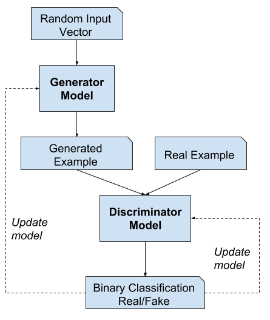
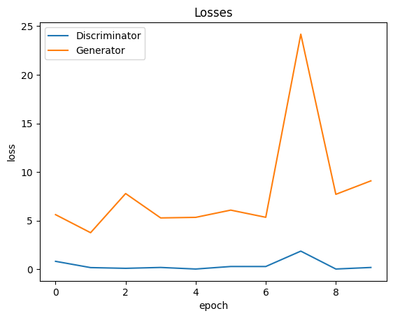
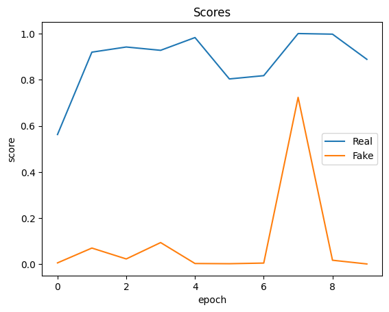

# Anime-Face-Generator
Generative Adversarial Networks or GANs , are used for Generative modeling. Generative modeling is an unsupervised learning task in machine learning that involves automatically discovering and learning the regularities or patterns in input data in such a way that the model can be used to generate or output new examples that plausibly could have been drawn from the original dataset.

## Model

In the realm of neural networks, there exist two essential components: the Generator and the Discriminator. The Generator's role is to craft synthetic samples from random vectors or matrices, while the Discriminator's task is to distinguish between "real" data drawn from the training set and "fake" data generated by the Generator. The training process unfolds in a cyclical manner: we first train the Discriminator for a few epochs, followed by training the Generator for a few epochs, and this cycle repeats. This iterative approach allows both the Generator and the Discriminator to refine their abilities over time.

It's important to note that GANs (Generative Adversarial Networks) can be notoriously challenging to train. They exhibit a high sensitivity to various factors, including hyperparameters, activation functions, and regularization techniques.

I used the https://github.com/Mckinsey666/Anime-Face-Dataset, which consists of over 63,000 cropped anime faces.

## Results

Video of each Epoch: https://drive.google.com/file/d/1H4XvkTNcWScp6wDrbG5PC82JacVhBhRU/view?usp=sharing

